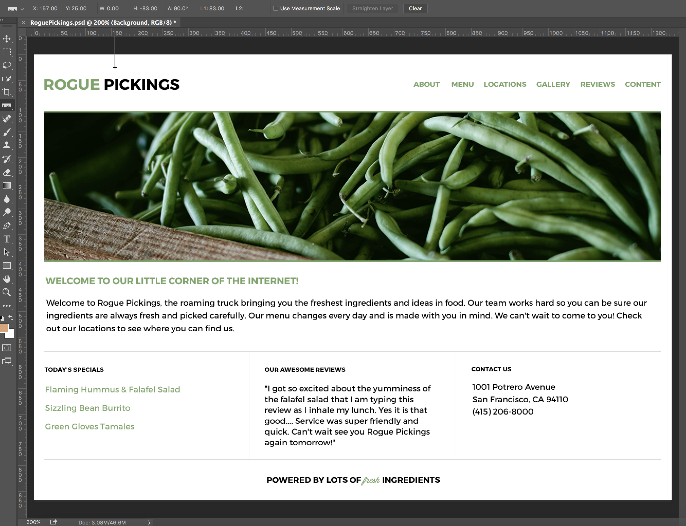

# Site mockup title Rogue Pickings from Photoshop Image File

Single page, sample client site created from a Photoshop image file using only HTML & CSS

* First: Set up your files (html, css, img)
* Next: Retrieve images from Photoshop file for your img folder
* Then: Create HTML structure and content from Photoshop image
* Now: Add Text, Links, and Assets to HTML
* Refer to Photoshop file for CSS info (see list below for info needed)
* Finally: Style your CSS

## Photoshop file used to:
* Extract Images
* Find page measurements (column size, padding)
* Find font name
* Find font style
* Find font size
* Find font color (Hex or RGB)

### View Completed site Here
[Live Demo](https://mccleary.github.io/Rogue-Pickings)

### View Photoshop Image Here

